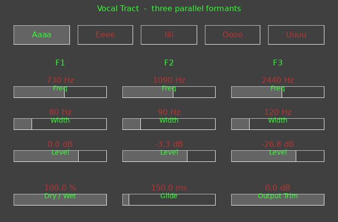

# VocalFilter

A three-formant vocal-tract model as a **VST3 and Audio Unit** effect for
macOS. Stereo in, stereo out. Feed it anything with harmonics and it puts a
vowel on it.



*(A layout render from `tools/render-panel.py`, not a screenshot — it is
generated from the editor's own layout constants so it cannot drift from the
code.)*

## What it does

On each channel, three bandpass resonators in **parallel**, summed, mixed
against the dry signal and trimmed:

```
in --+--> BP(F1) * A1 --+
     +--> BP(F2) * -A2 -+--> wet --+--> mix --> trim --> out
     +--> BP(F3) * A3 --+          |
     +--------- dry ---------------+
```

Parallel rather than cascaded because a parallel bank lets each formant carry
its own amplitude, which is the point of dialling a vowel by hand. F2 is
summed **inverted**: three bandpasses added in phase cancel between the peaks
and dig a null a real tract does not have.

[`docs/signal-path.png`](docs/signal-path.png) draws the whole thing —
including how the vowel selector and the glide reach the filters, and how the
display gets the values it draws.

The filters are RBJ constant-0 dB-peak bandpasses, so a formant's Level is its
level and the Width control is not secretly a second gain.

## The five vowels

One button each, and a **Vowel** parameter the host can automate.

| | Sound | F1 | F2 | F3 | B1 | B2 | B3 | A1 | A2 | A3 |
|---|---|---|---|---|---|---|---|---|---|---|
| Aaaa | /ɑ/ *father* | 730 | 1090 | 2440 | 80 | 90 | 120 | 0 | −3.3 | −26.8 |
| Eeee | /i/ *beet* | 270 | 2290 | 3010 | 50 | 100 | 140 | 0 | −8.0 | −2.3 |
| Iiii | /ɪ/ *bit* | 390 | 1990 | 2550 | 60 | 100 | 130 | 0 | −8.2 | −7.6 |
| Oooo | /o/ *boat* | 450 | 900 | 2400 | 60 | 90 | 120 | 0 | −7.4 | −30.0 |
| Uuuu | /u/ *boot* | 300 | 870 | 2240 | 50 | 90 | 120 | 0 | −10.2 | −30.0 |

Frequencies in Hz are the classic adult-male means from **Peterson & Barney
(1952)**, so all five sit in one consistent voice. The exception is Oooo: the
letter O names a diphthong, /oʊ/, which they did not measure, so that row
carries the common /o/ set and is marked as such in the source.

Bandwidths sit mid-range of the measured adult spread, narrower at B1 for the
close vowels.

**Levels are derived, not chosen.** A vocal tract is an all-pole filter, so
formant amplitudes are a consequence of the frequencies rather than free
parameters — which is why a cascade synthesiser needs no amplitude controls
and a parallel one cannot do without them. Each pair is fitted against the
all-pole cascade those formants imply. `ENGINEERING-NOTES.md` §2 has the method,
the numbers and the two wrong answers that came first.

## Controls

| Parameter | Range | Default |
|---|---|---|
| F1 / F2 / F3 **Freq** | 200–1200, 500–3000, 1500–4000 Hz | the Aaa patch |
| F1 / F2 / F3 **Width** | 20–400 Hz | 80 / 90 / 120 |
| F1 / F2 / F3 **Level** | −40 … +12 dB | 0 / −3.3 / −26.8 |
| **Dry / Wet** | 0–100 % | 100 |
| **Glide** | 0–2000 ms | 150 |
| **Output Trim** | −60 … 0 dB | 0 |
| **Vowel** | Manual, Aaaa, Eeee, Iiii, Oooo, Uuuu | Manual |

**Glide** is how long a formant takes to reach a new value. It is a timed
linear ramp, one length for all nine parameters, so however far each has to
travel they all arrive on the same sample. 150 ms by default because that is
roughly what a diphthong glide takes in speech. Zero is floored at 20 ms — an
instant jump of F2 from 870 Hz to 2290 Hz is a click.

**Vowel** is a mode. While it is on a preset the DSP uses that vowel's values
and the nine formant parameters are ignored; touching a slider on the panel
captures the preset's values and switches back to Manual, so nothing jumps.

The display draws each formant's response — F1 yellow, F2 green, F3 blue — and
the summed response in white, following the DSP in real time as it glides.

## Building

macOS, Xcode and CMake 3.25+.

```sh
git clone https://github.com/acobley/VocalFilter-VSTi.git
cd VocalFilter-VSTi
./setup-xcode.sh
```

The first configure clones the Steinberg VST3 SDK (~250 MB) into `external/`,
which takes a few minutes; later ones reuse it. To use a checkout you already
have:

```sh
VST3_SDK_ROOT=/path/to/vst3sdk ./setup-xcode.sh
```

`./setup-xcode.sh --help` lists the rest — `--no-open`, `--makefiles`,
`--no-au`, `--no-validator`, `--clean`.

Both bundles are ad-hoc signed automatically, which is enough for macOS to
load them, Apple Silicon included. Before shipping, run Steinberg's validator
and `auval -v aufx VcFl AECo`.

> **If you add a source file**, re-run `./setup-xcode.sh --no-open` before
> building. Sources are globbed with `CONFIGURE_DEPENDS`, and under the Xcode
> generator the first build after a file is added compiles the old file list
> anyway; a PRE_BUILD check catches it and names what changed.

## Tests

The DSP is deliberately free of SDK types, so the suite compiles and runs
standalone — no host, no SDK, no build system:

```sh
c++ -std=c++17 -O2 -Isource tests/DspTests.cpp source/VocalFilterDsp.cpp \
    -o /tmp/dsptests && /tmp/dsptests
```

47 assertions. They measure rather than assume: where the formant peaks
actually land, that the running filter matches the curve the display draws,
that the −3 dB width is the width that was asked for, that the response is
unchanged from 44.1 k to 192 k, that every glide setting lands on the right
sample, and that the fastest legal glide is 30 dB quieter at 6–12 kHz than an
instant jump. Several include a negative control, because a guard that has
never failed is a guess.

## Repository layout

| | |
|---|---|
| `source/` | the plug-in — `VocalFilterDsp.*` is the audio line and includes no SDK header |
| `tests/` | the SDK-free DSP suite |
| `tools/render-panel.py` | renders the editor layout to `docs/`, parsing the constants out of the headers |
| `docs/` | those renders, and the signal-path diagram — `docs/README.md` says how each is regenerated |
| `resource/au-info.plist` | the Audio Unit's identity |
| **`ENGINEERING-NOTES.md`** | **the engineering record** — every decision, the measurement behind it, and the things that turned out wrong |

VocalFilter is **not a port of anything** — there is no DXi behind it. It was
scaffolded from the build system the SpaceDub, ForTran and SpyBand DXi→VST3
ports share, which is where `CMakeLists.txt` and `setup-xcode.sh` come from;
the porting guide and checklist that template also carries have been removed,
because nothing here was ported and they only described how to. The custom
VSTGUI controls are lifted from the SpyBand port, with the class names kept so
the two copies can still be diffed.

## Identity

Bundle ids `audio.vocalfilter.vst3` and `audio.vocalfilter.audiounit`; Audio
Unit type/subtype/manufacturer `aufx` / `VcFl` / `AECo`. Along with the class
UIDs in `source/VocalFilterIDs.h`, these are permanent once a build has
shipped — change one and every existing session loses the plug-in.

---

Copyright 2026 A. E. Cobley. No licence is declared yet; add a `LICENSE` file
before sharing this expecting anyone else to reuse it.

VST is a trademark of Steinberg Media Technologies GmbH.
